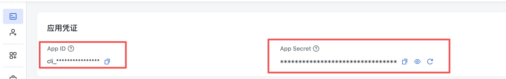
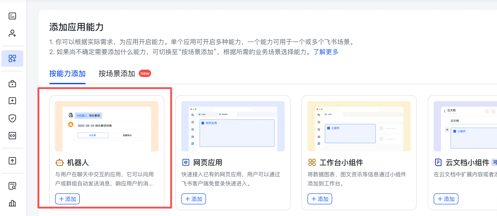
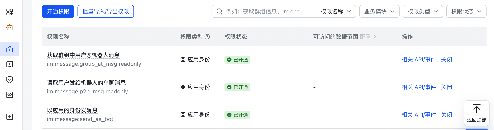
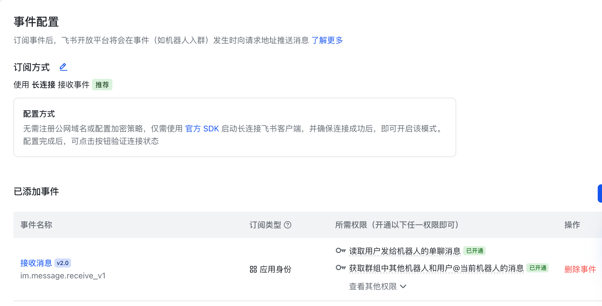

# Installation and Deployment

This document explains how to deploy this project locally.

## 1. Create a Feishu Bot

Go to the **[Feishu Open Platform](https://open.feishu.cn/)** and create an enterprise self-built app.

- Save the **App ID** and **App Secret** from **App Credentials**. You will use them later.


- **Add app capability**: select **Bot**.


- **Enable permissions**: the following permissions are required.


  You can also import permissions with this JSON:

```json
{
  "scopes": {
    "tenant": [
      "im:message.group_at_msg:readonly",
      "im:message.p2p_msg:readonly",
      "im:message:send_as_bot"
    ],
    "user": []
  }
}
```

- **Events & Callbacks**: configure these later after the service is running.

## 2. Start the Codex Service

You need one Codex app server process and one or more client sessions.

- Start the Codex app server.

  This process must **keep running in the background**. You can manage it with `nohup` / `pm2` / `docker` / `screen` / `tmux`.

```bash
codex app-server --listen ws://127.0.0.1:8787
```

- Open a Codex TUI and connect to this server.

  You can use Codex normally here, exactly the same as running the `codex` command directly.

```bash
codex --remote ws://127.0.0.1:8787
```

  Run `/statusline`, then enable this option:
  ` [x] session-id            Current session identifier (omitted until session starts)`
  Then you can see the current **session id** below the conversation. Save this id.

## 3. Start This Program

- **Prerequisite**

  Python 3.8+

- **Install dependencies**

```bash
pip install -r requirements.txt
```

- **Configure listening sessions**

Create `./runtime/listen_session_id.json` and record the Codex session(s) you want to listen to.

Example:

```json
{
  "MYSession1": "019eaaaa-1a11-7000-aaaa-11111111111",
  "MYSession2": "019eaaaa-1a11-7000-aaaa-22222222222"
}
```

`019eaaaa-1a11-7000-aaaa-11111111111` and `019eaaaa-1a11-7000-aaaa-22222222222` are two Codex **session ids**.

`MYSession1` and `MYSession2` are custom session aliases. You will bind these sessions in your Feishu bot later.

- **Start the service**

Example:

Set environment variables:

```bash
export APP_ID="cli_xxx"
export APP_SECRET="xxx"
export APP_SERVER_WS_URL="ws://127.0.0.1:8787"
export LISTEN_SESSION_ID_PATH="./runtime/listen_session_id.json"
```

Then run:

```bash
python app.py
```

This process also must **keep running in the background**. You can manage it with `nohup` / `pm2` / `docker` / `screen` / `tmux`.

## 4. Configure Message Callbacks

Go back to your app page on the **[Feishu Open Platform](https://open.feishu.cn/)** and configure **Events & Callbacks**.

### Configure Events

- Select **Subscription method**: `Receive events via long connection`
- Add event:

```text
Receive message
im.message.receive_v1
```



### Configure Callbacks

- Select **Subscription method**: `Receive callbacks via long connection`
- Add subscribed callback:

```text
Card action callback
card.action.trigger
```


## 5. Bot Command Shortcuts

- `/watch MYSession1` Listen to `MYSession1` with the current account.
- `/unwatch MYSession1` Stop listening to `MYSession1`.
- `/list_watches` Show the current watch list.

---
### Setup complete. You can start using it now.
