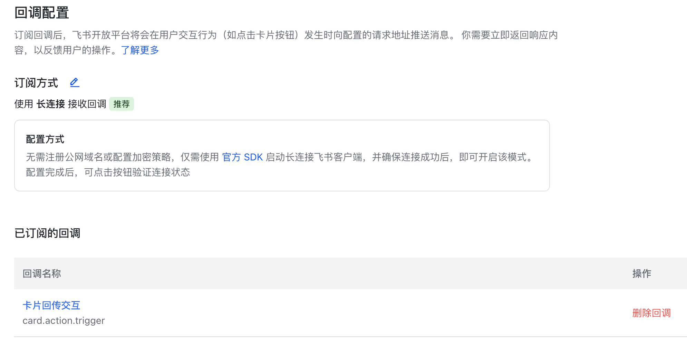

# 安装与部署

本文档说明如何在本地部署本项目。

## 1. 飞书机器人创建

前往**[飞书开放平台](https://open.feishu.cn/)**，创建企业自建应用

- 保存**应用凭证**中的App ID和App Secret，我们后面会用到


- **添加应用能力** 选择机器人


- **开通权限** 需要以下权限


   也可以使用以下json导入权限：

```json
{
  "scopes": {
    "tenant": [
      "im:message.group_at_msg:readonly",
      "im:message.p2p_msg:readonly",
      "im:message:send_as_bot"
    ],
    "user": []
  }
}
```

- **事件与回调**: 稍后我们在启动服务后配置。


## 2. 启动codex服务

我们需要启动一个codex服务端，和若干客户会话端。

- 启动codex服务端。

   此进程需要**保持后台运行**，你可以用nohup/pm2/docker/screen/tmux等方式管理。

```bash
codex app-server --listen ws://127.0.0.1:8787
```

- 开启一个 Codex TUI ，连接这个服务器端

   你可以在这里正常使用codex，和命令`codex`效果完全一致。
   
```bash
codex --remote ws://127.0.0.1:8787
```

   输入`/statusline`，在选项中开启
    ` [x] session-id            Current session identifier (omitted until session starts)` 
    即可在对话下方看到当前的**session id**。我们记录下这个id
   
## 3. 启动程序
-  **前置条件**

  Python 3.8+ 运行环境

-  **安装依赖**

```bash
pip install -r requirements.txt
```

- **配置监听会话**

创建 `./runtime/listen_session_id.json`, 记录你希望监听的codex的 session。

一个示例如下：

```json
{
  "MYSession1": "019eaaaa-1a11-7000-aaaa-11111111111",
  "MYSession2": "019eaaaa-1a11-7000-aaaa-22222222222"
}
```

"019eaaaa-1a11-7000-aaaa-11111111111" 和 "019eaaaa-1a11-7000-aaaa-22222222222" 是两个codex的 **session id**

"MYSession1"和"MYSession2"，是自定义的session标识，后续你会在飞书机器人里绑定会话。

- **启动服务**

示例：

配置环境变量

```bash
export APP_ID="cli_xxx"
export APP_SECRET="xxx"
export APP_SERVER_WS_URL="ws://127.0.0.1:8787"
export LISTEN_SESSION_ID_PATH="./runtime/listen_session_id.json"
```
然后启动服务

```bash
python app.py
```

此同样进程需要**保持后台运行**，你可以用nohup/pm2/docker/screen/tmux等方式管理。

## 4. 配置消息回调

回到**[飞书开放平台](https://open.feishu.cn/)**的应用页面，配置 **事件与回调** 。

### 配置事件

- 选择**订阅方式**：` 使用长连接接收事件`
- 添加事件：
```
接收消息
im.message.receive_v1
```


### 配置回调

- 选择**订阅方式**：` 使用长连接接收回调`
- 添加已订阅的回调：
```
卡片回传交互
card.action.trigger
```



## 5. 机器人操作快捷方式
- `/watch MYSession1 ` 以当前账号监听MYSession1会话
- `/unwatch MYSession1` 取消监听MYSession1会话
- `/list_watches` 查看当前监听会话列表

---
### 准备就绪，可以开始使用了。


